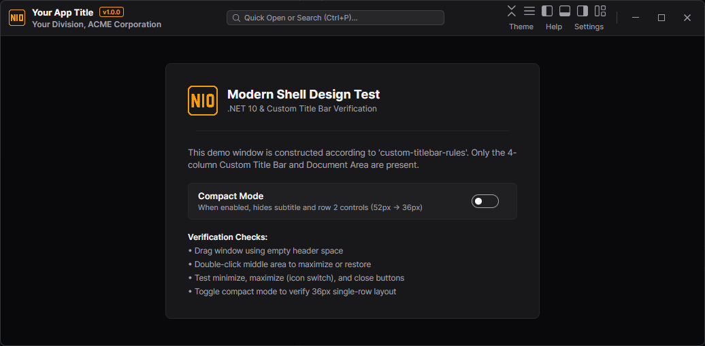
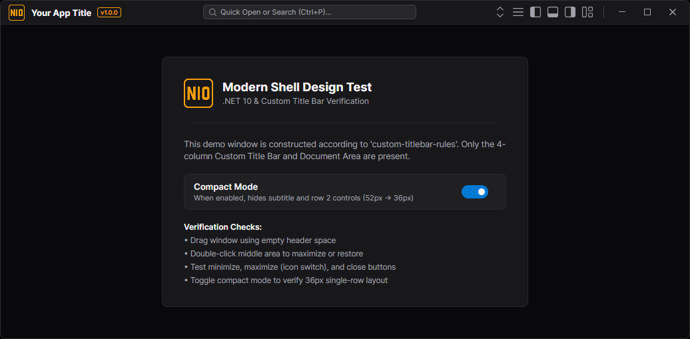

# Avalonia Custom Application Title Bar

A fully generic, modular, and high-performance custom application title bar component for **Avalonia UI** (.NET 8 / 9 / 10). Designed for modern desktop shells, IDEs, and professional enterprise applications.

---

## 📸 Preview

### Standard Mode (52px)
Includes two rows in the identity section (Title + Subtitle) and spacious action areas:



---

### Compact Mode (36px)
Optimized for maximum screen real estate (e.g., laptop screens or dense workflows). Automatically collapses subtitles and secondary rows while keeping icons and titles vertically centered:



---

## ✨ Key Features

- **4-Column Modular Slot Architecture:**
  - **Column 0 (Identity):** App logo, title, version badge, and optional subtitle.
  - **Column 1 (Header Content):** Global search bar, omnibox, breadcrumbs, or quick switcher.
  - **Column 2 (Primary Actions):** Command buttons (e.g., layout switcher, compact toggle, view toggles).
  - **Column 3 (Secondary Actions & Window Controls):** User avatar, theme switcher, help menu, followed by native Minimize, Maximize/Restore, and Close buttons.
- **Dynamic Compact Mode (52px $\leftrightarrow$ 36px):**
  - Instant height switching with clean mathematical centering of icons and text.
  - Automatically synchronizes with Avalonia's `ExtendClientAreaTitleBarHeightHint`.
- **Zero-Dependency Vector Window Controls:**
  - Crisp `10x10 px` vector path icons (`PathIcon`) for Minimize, Maximize, Restore, and Close buttons encapsulated directly inside the control resources.
  - Windows 11-style close button hover effects (`#E81123`).
  - Automatic icon switching between Maximize (`🗖`) and Restore (`🗗`) upon window state changes.
- **Native Window Behavior:**
  - Drag window anywhere across empty title bar space.
  - Double-click on header / empty space to toggle maximize/restore.
  - Supports `WindowDecorations="BorderOnly"` with client area extension.
- **Theme-Aware (Dark & Light Mode):**
  - Fully decoupled using `DynamicResource` tokens. Adapts instantly to theme switches without control reload.
- **Zero Hardcoded Magic Strings:**
  - Fully compatible with dynamic localization markup extensions (`LocExtension`) or standard MVVM data bindings.
- **VS Code-Style Vector Iconography:**
  - Action and layout icons are adapted from [microsoft/vscode-codicons](https://github.com/microsoft/vscode-codicons) with 1px hairline rendering and zero external runtime dependencies.

---

## 📁 Files to Copy to Your Project

To integrate the title bar into an existing or new Avalonia application, copy the following files:

| Source File / Directory | Target Location in Your Project | Purpose |
|:---|:---|:---|
| `Controls/TitleBar/AppTitleBar.axaml` | `Controls/TitleBar/AppTitleBar.axaml` | Title bar XAML layout and vector resources |
| `Controls/TitleBar/AppTitleBar.axaml.cs` | `Controls/TitleBar/AppTitleBar.axaml.cs` | Code-behind: slots, window dragging, compact mode sync |
| `Themes/` or your Theme Dictionaries | Your App's Theme Resources | Brush resources (`AppTitleBarBackgroundBrush`, etc.) |
| *(Optional)* `Localization/` | `Localization/` | Dynamic culture switching and key lookup |

---

## 🚀 Step-by-Step Integration Guide

### Step 1: Ensure Project File Configuration

Make sure your `.csproj` includes assets and resource files appropriately:

```xml
<ItemGroup>
  <AvaloniaResource Include="Assets\**" />
</ItemGroup>
```

### Step 2: Configure `MainWindow.axaml`

In your root window (`MainWindow.axaml`), enable extended client area decorations and set the initial title bar height hint:

```xml
<Window xmlns="https://github.com/avaloniaui"
        xmlns:x="http://schemas.microsoft.com/winfx/2006/xaml"
        xmlns:titlebar="clr-namespace:YourApp.Controls.TitleBar"
        x:Class="YourApp.Views.MainWindow"
        Title="Your Application"
        Width="1200" Height="750"
        WindowDecorations="BorderOnly"
        ExtendClientAreaToDecorationsHint="True"
        ExtendClientAreaTitleBarHeightHint="52">

    <Grid RowDefinitions="Auto,*">
        <!-- Custom Title Bar at Row 0 -->
        <titlebar:AppTitleBar Grid.Row="0"
                             Title="Your App"
                             VersionText="v1.0.0"
                             Subtitle="Your Application Subtitle">
            <!-- Inject your custom slot contents here -->
        </titlebar:AppTitleBar>

        <!-- Main Window Document / Workspace Content at Row 1 -->
        <Border Grid.Row="1" Background="{DynamicResource AppSurfaceBackgroundBrush}">
            <!-- Your main workspace content -->
        </Border>
    </Grid>
</Window>
```

### Step 3: Inject Custom Content into Slots

The title bar provides modular slots. You can populate any or all of them directly in XAML:

```xml
<titlebar:AppTitleBar Grid.Row="0"
                     Title="Modern Shell"
                     VersionText="v1.0.0"
                     Subtitle="Desktop Application"
                     IsCompact="{Binding IsCompactMode}">

    <!-- Column 0: Logo / Icon Slot -->
    <titlebar:AppTitleBar.IconContent>
        <Image Source="/Assets/app-logo.png" Width="20" Height="20" />
    </titlebar:AppTitleBar.IconContent>

    <!-- Column 1: Center Header / Search Slot -->
    <titlebar:AppTitleBar.HeaderContent>
        <TextBox Width="360"
                 Watermark="Quick Search (Ctrl+P)..."
                 Classes="search-box" />
    </titlebar:AppTitleBar.HeaderContent>

    <!-- Column 2: Primary Actions Slot -->
    <titlebar:AppTitleBar.PrimaryActions>
        <StackPanel Orientation="Horizontal" Spacing="4">
            <Button Content="Compact" Command="{Binding ToggleCompactCommand}" />
            <Button Content="Sidebar" Command="{Binding ToggleSidebarCommand}" />
        </StackPanel>
    </titlebar:AppTitleBar.PrimaryActions>

    <!-- Column 3: Secondary Actions Slot (Precedes window control buttons) -->
    <titlebar:AppTitleBar.SecondaryActions>
        <StackPanel Orientation="Horizontal" Spacing="4">
            <Button Content="Theme" Command="{Binding ToggleThemeCommand}" />
            <Button Content="Help" Command="{Binding OpenHelpCommand}" />
        </StackPanel>
    </titlebar:AppTitleBar.SecondaryActions>

</titlebar:AppTitleBar>
```

---

## 🎛️ Configurable Properties & Slots

| Property / Slot | Type | Default | Description |
|:---|:---|:---|:---|
| `IconContent` | `object?` | `null` | Slot for application logo, icon, or branding image. |
| `Title` | `string` | `""` | Main application title text. |
| `VersionText` | `string` | `""` | Version badge text displayed next to the title. |
| `Subtitle` | `string` | `""` | Subtitle displayed in Row 1 (automatically hidden in compact mode). |
| `HeaderContent` | `object?` | `null` | Slot for search bar, breadcrumbs, or middle header widgets. |
| `PrimaryActions` | `object?` | `null` | Slot for quick action buttons, layout toggles, or tools. |
| `SecondaryActions` | `object?` | `null` | Slot for user profile, theme switch, settings, or help buttons. |
| `IsCompact` | `bool` | `false` | Toggles compact mode (switches height between 52px and 36px). |

---

## 🎨 Theme Tokens

The component relies on standard dynamic brush resources. Ensure the following brushes (or equivalent theme mappings) exist in your application styles:

```xml
<!-- Light / Dark Adaptive Theme Tokens -->
<SolidColorBrush x:Key="AppTitleBarBackgroundBrush" Color="#1E1E2E" />
<SolidColorBrush x:Key="AppTitleBarForegroundBrush" Color="#CDD6F4" />
<SolidColorBrush x:Key="AppTitleBarBorderBrush" Color="#313244" />
<SolidColorBrush x:Key="AppTitleBarButtonHoverBrush" Color="#313244" />
<SolidColorBrush x:Key="AppTitleBarButtonPressedBrush" Color="#45475A" />
<SolidColorBrush x:Key="AppTitleBarCloseHoverBrush" Color="#E81123" />
```

---

## 💻 Running the Demo Project

To build and run the included sample project:

```bash
# Clone the repository
git clone https://github.com/gozkeser/avalonia-custom-titlebar.git
cd avalonia-custom-titlebar

# Run the demo app
dotnet run --project src/TitleBarDemo/TitleBarDemo.csproj
```

---

## 🙏 Credits & Iconography Attribution

The action and workbench layout vector geometries used in the demo shell are adapted from the open-source [Microsoft VS Code Codicons](https://github.com/microsoft/vscode-codicons) library (licensed under [CC-BY-4.0](https://github.com/microsoft/vscode-codicons/blob/main/LICENSE)) to achieve visual parity and styling consistent with Visual Studio Code's desktop shell.

---

## 📄 License

This project is licensed under the MIT License - see the [LICENSE](LICENSE) file for details.
